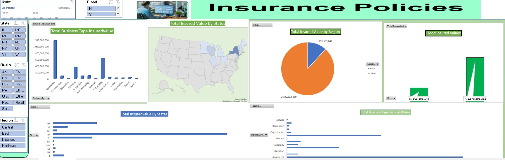
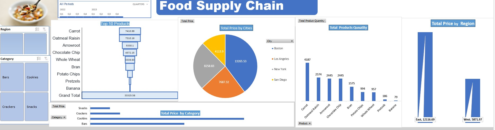

# Project 1

**Title:** https://github.com/AyimanB/AyimanB.github.io/blob/main/Insurance%20Policies%20Data%20DashBoard.xlsx

**Tools Used:** Advance Excel( Pivot Table, Pivot Chart, Slicers, Timeline)

**Project Description:** Project Description: This project involved analysing the Insurance policies data of an Insurance company to identify trends and patterns in insured business type and values. It is designed to provide a comprehensive overview of the region, the states, and the business type. This dashboard allows stakeholders to easily monitor and analyze the company’s insurance policies across different regions, states, and types of disaster, either flood or earthquake. The dashboard includes the following features: Total business type insured: total insured value by region, flood insured value vs earthquake insured values, total insured value by state.

**Key findings:**  The Urban towns had more volumes of total insured values by region. flood also recorded more values from flood-related insurance claims.

**Dashboard Overview:** This dashboard serves as a crucial tool for the Insurance policy management team, providing clear, actionable insights that drive informed decision-making and strategic planning.

# Project 2

**Title:** https://github.com/AyimanB/AyimanB.github.io/blob/main/Food%20Supply%20DashBoard.xlsx

**Tools Used:** Advance Excel( Pivot Table, Pivot Chart, Slicers, Timeline)

**Project Description:** Project Description: This project involved analysing the food supply chain data of a food distribution company to identify trends and patterns in food distribution. It is designed to provide a comprehensive overview of the region sales, the products, and the total price by region. This dashboard allows stakeholders to easily monitor and analyze the company’s food sales across different regions, states, and quantities, and categories. The dashboard includes the following features: Top 10 products, total price by cities, total price by region,.

**Key findings:**  The top 10 products are carrots, Oatmeal, Arrowroot, Chocolate chips and Whole wheat, etc. Other very important findings are east with the highest values and Boston with the highest sales.

**Dashboard Overview: ** This dashboard will help with important information for the management team to have clear, actionable insights that drive informed decision-making and strategic planning in driving productive and scaling the business. 

